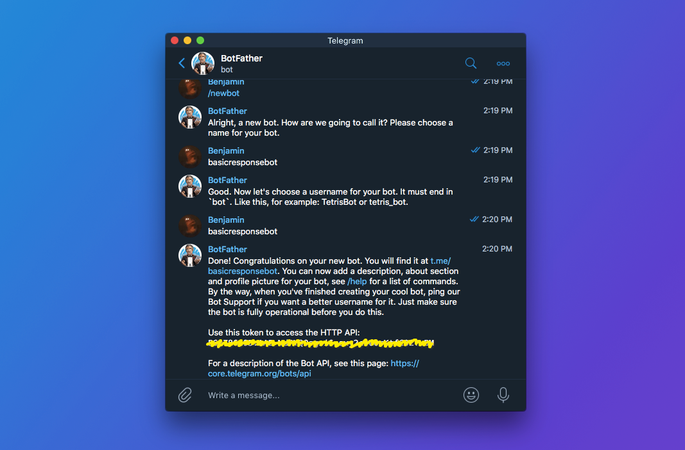

# Telegram Notify Bot


### You can set up a command to get a notification on Telegram to let you know when one of your *long* commands has finally finished executing

## Use Case

Insead of:

```bash
sudo pacman -Syu
```

You can add `&& notify` to the end to get a notification

```bash
sudo pacman -Syu && notify
```

## Dependencies

- python
- pip
- pyTelegramBotAPI
- an AUR helper (arch only)

### Arch Dependency Installation

```bash
sudo pacman -Syu
sudo pacman -S python
sudo pacman -S python-pip
yay -S python-pytelegrambotapi
```

### Debian-Based Dependency Installation

```bash
sudo apt update
sudo apt install python3
sudo apt install python3-pip
pip install pytelegrambotapi
```

# Installation

## Step 1
- install all dependencies from above according to your distrobution

## Step 2
- search up **@BotFather** on Telegram
- message `/newbot` to the BotFather
- you will be asked to choose a **name** for your bot, it can be anything, I chose `NotiBot`
- you will be asked to choose a **username** for your bot, it can be anything, but must be unique
    - remember this username for later.
- the BotFather will then send you your **API Token** for your Telegram bot



## Step 3
- export your bot's API as an environment variable by running the following command, ensuring to **replace your API Token for the placeholder**.

```bash
echo 'export BOT_TOKEN="api-token-key-here"' >> ~/.bashrc
source ~/.bashrc
```

## Step 4
- download this repo. Or clone it by running the following command:

```bash
git clone https://github.com/cjlangan/telegram-notify-bot
```

- navigate into the repo folder and ensure that the scrpts are executable:

```bash
cd telegram-notify-bot/
chmod +x notify.py
chmod +x get-id.py
```

## Step 5
- Run the `get-id.py` script.

```bash
python get-id.py
```

- this script will continue running until you message your bot.
- message your bot at the **username** you gave it from earlier
- send any message and the installation will complete
